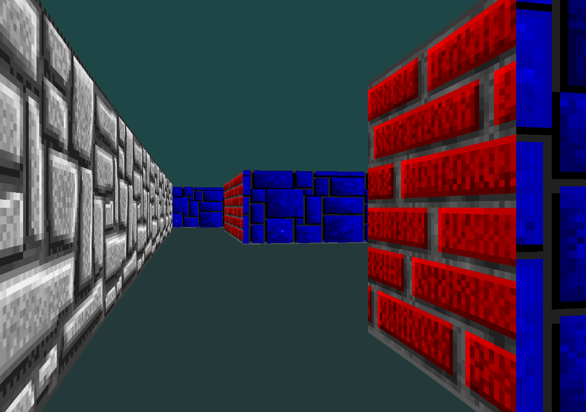

# cub3D - 3D Raycasting Engine 🎮

A 3D raycasting game engine inspired by Wolfenstein 3D, built as part of the 42 School curriculum.

## 📸 Screenshots

<p align="center">
  
</p>


## 📋 Table of Contents
- [About](#about)
- [Demo](#demo)
- [Features](#features)
- [Installation](#installation)
- [Usage](#usage)
- [Map Configuration](#map-configuration)
- [Controls](#controls)
- [Project Structure](#project-structure)
- [Technical Details](#technical-details)
- [Contributing](#contributing)

## 🎯 About

cub3D is a 3D raycasting engine that recreates the classic rendering technique used in 1990s games like Wolfenstein 3D and DOOM. This project demonstrates fundamental 3D graphics programming concepts and real-time rendering techniques.

### Learning Objectives
- 🎨 Understand raycasting algorithms and 3D projection
- 🖥️ Master low-level graphics programming with MLX42
- ⚡ Implement real-time rendering and game loops
- 🎮 Handle user input and window management
- 📁 Parse configuration files and validate input data

## ✨ Features

### Core Features
- ✅ Real-time 3D first-person view rendering
- ✅ Textured walls with orientation-specific textures (N/S/E/W)
- ✅ Configurable floor and ceiling colors
- ✅ Smooth player movement and collision detection
- ✅ Camera rotation with keyboard controls
- ✅ Map parsing from `.cub` configuration files
- ✅ Proper memory management and error handling

### Technical Highlights
- **Raycasting Algorithm**: Digital Differential Analysis (DDA)
- **Texture Mapping**: Real-time texture application on walls
- **Collision System**: Prevents walking through walls
- **Performance**: Optimized for smooth 60 FPS gameplay

### Build Instructions
```bash
# Clone the repository
git clone https://github.com/benaddihichame/Cub3d.git
cd Cub3d

# Compile the project
make

# Clean build files (optional)
make clean

# Remove all generated files (optional)
make fclean

# Recompile everything (optional)
make re
```

## 🎮 Usage

```bash
# Run the game with a map file
./cub3d assets/maps/good/maze.cub

# Try different maps
./cub3d assets/maps/good/dungeon.cub
./cub3d assets/maps/good/library.cub
```

## 🗺️ Map Configuration

Maps are defined in `.cub` files with this structure:

```
NO ./assets/textures/north.png
SO ./assets/textures/south.png
WE ./assets/textures/west.png
EA ./assets/textures/east.png

F 164,169,20
C 153,204,254

1111111111111111111111111
1000000000110000000000001
1011000001110000000000001
1001000000000000000000001
111111111011000001110000000000001
100000000011000001110111110111111
11110111111111011100000010001
11110111111111011101010000001
11000000110101011100000010001
10000000000000000000000000001
10000000000000001101010010001
11000001110101011111011110N0111
11110111 1110101 101111010001
11111111 1111111 111111111111
```

### Map Elements
- **NO/SO/WE/EA**: Texture paths for North/South/West/East walls
- **F**: Floor color (RGB: 0-255)
- **C**: Ceiling color (RGB: 0-255)
- **1**: Wall
- **0**: Empty space
- **N/S/E/W**: Player starting position and orientation

## 🎮 Controls

| Key | Action |
|-----|--------|
| `W` | Move forward |
| `S` | Move backward |
| `A` | Strafe left |
| `D` | Strafe right |
| `←` | Rotate camera left |
| `→` | Rotate camera right |
| `ESC` | Exit game |

## 📁 Project Structure

```
cub3d/
├── src/                    # Source files
│   ├── main.c             # Program entry point
│   ├── parsing.c          # Configuration file parsing
│   ├── parsing_map.c      # Map validation
│   ├── texture_parsing.c  # Texture handling
│   ├── mlx.c             # Core raycasting engine
│   ├── render.c          # Rendering pipeline
│   ├── keys.c            # Input handling
│   └── utils*.c          # Utility functions
├── include/
│   ├── cub3d.h           # Main header
│   └── MLX42.h           # Graphics library
├── assets/
│   ├── maps/             # Example maps
│   └── textures/         # Wall textures
├── Makefile              # Build configuration
└── README.md
```

## ⚙️ Technical Details

### Raycasting Algorithm
The engine implements the DDA algorithm for efficient ray-grid traversal:

1. **Ray Casting**: Cast rays for each screen column
2. **Grid Traversal**: Step through map grid until wall collision
3. **Distance Calculation**: Calculate perpendicular distance
4. **Wall Projection**: Convert 3D coordinates to 2D screen space
5. **Texture Mapping**: Apply textures based on wall orientation

### Key Technologies
- **Language**: C
- **Graphics**: MLX42 (42's OpenGL wrapper)
- **Build System**: Makefile
- **Platform**: Linux/macOS

### Performance Optimizations
- Efficient ray-casting with DDA algorithm
- Optimized texture mapping
- Memory-conscious data structures
- Real-time collision detection

## 🧪 Error Handling

The program validates input and handles various error conditions:

- ❌ Invalid or missing `.cub` file
- ❌ Map not properly enclosed by walls
- ❌ Missing or corrupted texture files
- ❌ Invalid RGB color values (must be 0-255)
- ❌ Multiple or missing player start positions
- ❌ Invalid characters in map data

## 🤝 Contributing

This project is part of the 42 School curriculum. While it's primarily educational, suggestions and improvements are welcome!

1. Fork the repository
2. Create a feature branch (`git checkout -b feature/amazing-feature`)
3. Commit your changes (`git commit -m 'Add amazing feature'`)
4. Push to the branch (`git push origin feature/amazing-feature`)
5. Open a Pull Request

## 📚 Resources

- [Raycasting Tutorial by Lodev](https://lodev.org/cgtutor/raycasting.html)
- [MLX42 Documentation](https://github.com/codam-coding-college/MLX42)
- [Wolfenstein 3D Source Code](https://github.com/id-Software/wolf3d)
